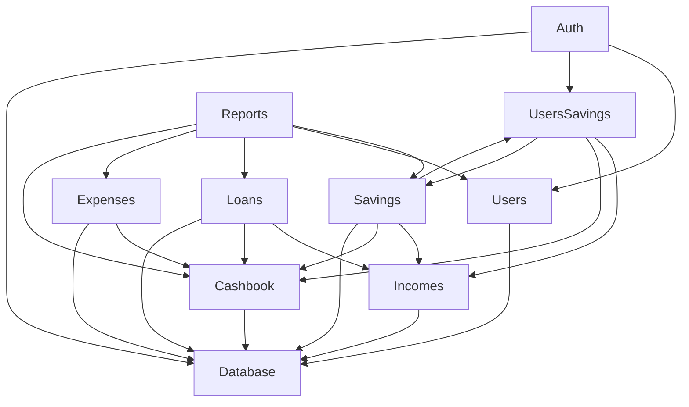

# 🏗️ Lumbung Mesari — System Architecture

## Overview

**Lumbung Mesari** is a cooperative financial management system (Sistem Informasi Koperasi) built to manage member savings, loans, and the cooperative's cashbook. The system serves a traditional Indonesian cooperative (_koperasi_), digitizing processes like member registration, loan disbursement, installment tracking, penalty enforcement, and financial reporting.

---

## Tech Stack

| Layer                   | Technology                             |
| ----------------------- | -------------------------------------- |
| **Runtime**             | Node.js                                |
| **Framework**           | NestJS (modular, DI-based)             |
| **Language**            | TypeScript                             |
| **Database**            | PostgreSQL                             |
| **ORM / Query Builder** | Knex.js (migrations + query builder)   |
| **Authentication**      | JWT (access + refresh tokens)          |
| **Scheduling**          | `@nestjs/schedule` + `cron`            |
| **API Docs**            | Swagger / OpenAPI                      |
| **Security**            | Helmet, CORS, bcrypt, OTP verification |
| **Email**               | Email service (OTP, notifications)     |
| **Precision Math**      | Decimal.js                             |

---

## High-Level Architecture

```
┌──────────────────────────────────────────────────────────────────┐
│                        CLIENT (Frontend)                        │
└──────────────────────────┬───────────────────────────────────────┘
                           │ HTTP / REST
                           ▼
┌──────────────────────────────────────────────────────────────────┐
│                     NestJS Application                          │
│  ┌────────────┐  ┌────────────┐  ┌────────────┐  ┌───────────┐ │
│  │    Auth     │  │   Users    │  │   Loans    │  │  Savings  │ │
│  │   Module    │  │   Module   │  │   Module   │  │  Module   │ │
│  └─────┬──────┘  └─────┬──────┘  └─────┬──────┘  └─────┬─────┘ │
│        │               │               │               │       │
│  ┌─────┴──────┐  ┌─────┴──────┐  ┌─────┴──────┐  ┌─────┴─────┐ │
│  │  Incomes   │  │  Expenses  │  │  Cashbook  │  │  Reports  │ │
│  │  Module    │  │   Module   │  │   Module   │  │  Module   │ │
│  └────────────┘  └────────────┘  └────────────┘  └───────────┘ │
│                                                                 │
│  ┌──────────────────────┐  ┌──────────────────────────────────┐ │
│  │  Notifications Module│  │  Users-Savings Module            │ │
│  └──────────────────────┘  └──────────────────────────────────┘ │
└──────────────────────────┬───────────────────────────────────────┘
                           │ Knex.js
                           ▼
┌──────────────────────────────────────────────────────────────────┐
│                       PostgreSQL                                │
│  ┌────────────────────────────────────────────────────────────┐  │
│  │  Tables  │ Triggers │ Constraints │ Functions │ Indexes    │  │
│  └────────────────────────────────────────────────────────────┘  │
└──────────────────────────────────────────────────────────────────┘
```

---

## Module Architecture

The application follows NestJS's modular architecture. Each module encapsulates a bounded context.

### Core Modules

| Module                 | Responsibility                                                                 |
| ---------------------- | ------------------------------------------------------------------------------ |
| **AuthModule**         | Registration, login, JWT tokens, OTP email verification                        |
| **UsersModule**        | User CRUD, role management, member approval flow                               |
| **LoansModule**        | Loan lifecycle (create → approve → disburse → settle), installments, penalties |
| **SavingsModule**      | Mandatory savings (monthly), principal savings (one-time)                      |
| **IncomesModule**      | Income record creation for savings, installments, interest, penalties          |
| **ExpensesModule**     | Operational expense tracking with source allocation (SHU/Capital/Auto)         |
| **CashbookModule**     | Cashbook transactions & balance management                                     |
| **ReportsModule**      | Excel report generation (monthly financial, savings reports)                   |
| **NotificationModule** | In-app notifications + email logs                                              |
| **UsersSavingsModule** | Cross-cutting logic for principal savings settlement during user approval      |

### Module Dependencies



---

## Application Layers (Per Module)

Each module follows a consistent layered pattern:

```
┌─────────────────┐
│   Controller     │  ← HTTP route handlers, DTOs validation, Swagger decorators
├─────────────────┤
│    Service       │  ← Business logic, transaction orchestration
├─────────────────┤
│   Repository     │  ← Knex queries, data access layer
├─────────────────┤
│   Database       │  ← PostgreSQL (tables, triggers, constraints)
└─────────────────┘
```

**Supporting pieces:**

- **DTOs** — Request/response validation with `class-validator`
- **Interfaces** — TypeScript type definitions for database rows
- **Exceptions** — Custom domain exceptions
- **Schedulers** — Cron jobs (overdue check, savings generation)

---

## Security Architecture

### Authentication Flow

1. **Registration** → User registers → status = `pending` → OTP sent via email
2. **OTP Verification** → OTP verified → status = `waiting_deposit` → principal savings record created
3. **Admin Approval** → Admin approves → principal savings settled → cashbook transaction created → status = `active`
4. **Login** → Credentials verified → JWT `access_token` + `refresh_token` issued

### Authorization

- **Roles**: `superadministrator`, `administrator`, `member`
- Route-level guards enforce role-based access control
- Members can only access their own data
- Admin/Superadmin can manage all members and approve transactions

---

## Scheduled Jobs

| Job                            | Schedule                      | Description                                                                          |
| ------------------------------ | ----------------------------- | ------------------------------------------------------------------------------------ |
| **Overdue Installments Check** | 21st of every month, midnight | Marks unpaid installments as `overdue`, applies penalties for 2+ consecutive overdue |
| **Yearly Savings Generation**  | Configurable (Jan 1st)        | Generates mandatory savings records for all active members for the year              |

---

## API Structure

All endpoints are prefixed with `/api` and documented via Swagger at `/docs`.

| Prefix               | Key Endpoints                                                     |
| -------------------- | ----------------------------------------------------------------- |
| `/api/auth`          | Login, register, OTP verify, refresh token                        |
| `/api/users`         | CRUD, approval flow, member listing                               |
| `/api/loans`         | Create, approve, disburse, reject, calculate, settle installments |
| `/api/savings`       | Mandatory/principal savings, settle, generate                     |
| `/api/expenses`      | CRUD with automatic cashbook transactions                         |
| `/api/cashbook`      | Balance queries, recent transactions                              |
| `/api/reports`       | Excel report generation (monthly, savings)                        |
| `/api/notifications` | User notifications, read status                                   |

---

## Key Design Principles

1. **Database-level integrity** — Critical business rules enforced via PostgreSQL triggers and constraints (see [decisions/](decisions/))
2. **Transactional consistency** — All financial operations use database transactions with pessimistic locking (`FOR UPDATE`)
3. **Accrual accounting** — Income from installments is split: principal → Capital, interest/penalty → SHU
4. **Separation of concerns** — App-level creates transactions; DB triggers automatically update balances
5. **Audit trail** — Cashbook transactions store balance snapshots (before/after) for every operation
