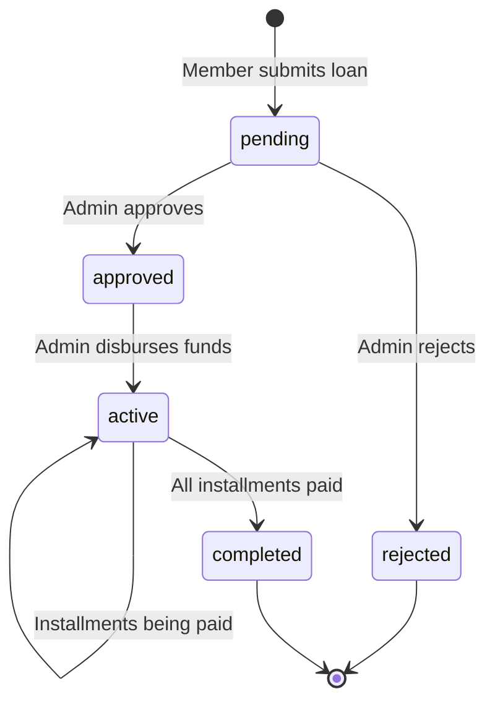
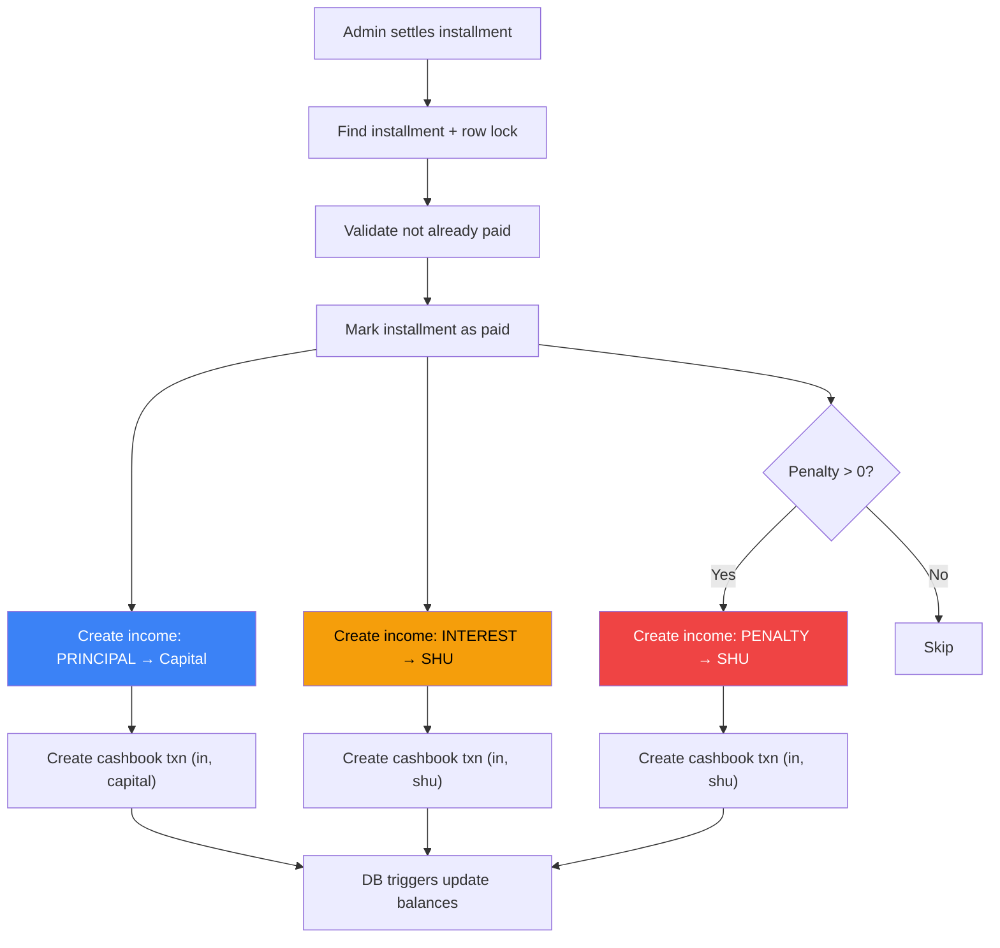

# 💰 Business Flow: Loans System

> A complete guide for developers on how the loan system works — from application to final settlement.

---

## Overview

The loan system allows cooperative members to borrow money with a flat interest rate over a fixed tenor. The loan goes through a defined lifecycle, and each installment settlement generates multiple income records split across different balance buckets.

---

## 1. Loan Lifecycle

| Status      | Meaning                                             |
| ----------- | --------------------------------------------------- |
| `pending`   | Loan submitted by member, awaiting admin review     |
| `approved`  | Admin approved the loan, funds not yet given        |
| `active`    | Money disbursed to member, installments in progress |
| `rejected`  | Loan application denied by admin                    |
| `completed` | All installments paid in full                       |

---

## 2. Loan Creation (Member)

**Endpoint**: `POST /api/loans`  
**Who**: Any active member

### What happens:

1. Member selects a **loan period** (tenor + interest rate) and specifies the **principal amount**
2. System calculates:
   - **Admin fee**: 2% of principal (`ADMIN_FEE_RATE` env var, default 0.02)
   - **Disbursed amount**: `principal - admin_fee`
   - **Monthly interest** (flat): `principal × interest_rate`
   - **Monthly principal** (rounded): `principal / tenor`, rounded up to nearest 500 or 1,000 IDR
   - **Monthly payment**: `rounded_principal + monthly_interest`
   - **Last month payment**: remainder principal + monthly interest (to ensure exact total)
   - **Total payable**: `principal + (monthly_interest × tenor)`

### Rounding Strategy

Monthly principal is rounded **up** to the nearest 500 or 1,000 IDR for clean payment amounts:

- `15,425` → `15,500` (round to next 500)
- `15,675` → `16,000` (round to next 1,000)
- `25,000` → `25,000` (already clean)

The **last month's principal** is calculated as `principal - (rounded_principal × (tenor - 1))`, ensuring the total principal paid exactly equals the original loan principal.

### Database Constraint

> ⚠️ **Max 3 concurrent loans**: A user cannot have more than 3 loans in `pending`, `approved`, or `active` status. This is enforced at the **database level** via a trigger. The app catches the database error and returns a friendly 400 message.

---

## 3. Loan Approval (Admin)

**Endpoint**: `POST /api/loans/:id/approve`  
**Who**: Admin or Superadmin

- Validates the loan is in `pending` status
- Updates status to `approved`
- Records `approved_by` (admin user ID) and `approved_at` timestamp
- **No installments are generated yet** — this happens at disbursement

---

## 4. Loan Disbursement (Admin)

**Endpoint**: `POST /api/loans/:id/disburse`  
**Who**: Admin or Superadmin

This is the point where the cooperative gives money to the member.

### What happens:

1. Validates loan is in `approved` status
2. Within a database transaction:
   - Updates loan status to `active`
   - Sets `disbursed_at` to current date
   - **Generates all installments** upfront

### Installment Generation Rules

| Property      | Value                                                                         |
| ------------- | ----------------------------------------------------------------------------- |
| **Due date**  | 20th of each month, starting the month after disbursement                     |
| **Principal** | Rounded monthly principal for months 1 to (tenor-1); remainder for last month |
| **Interest**  | Same flat amount every month                                                  |
| **Penalty**   | Initialized to 0                                                              |
| **Status**    | `due`                                                                         |

**Example**: A 6-month loan disbursed on Feb 15, 2025 generates installments due on:

- March 20, April 20, May 20, June 20, July 20, August 20

---

## 5. Installment Settlement (Admin)

**Endpoint**: `POST /api/loans/installments/:id/settle`  
**Who**: Admin or Superadmin

This is how members pay their monthly loans. Admin records the payment.

### What happens (all within one transaction):

### Accrual Accounting Split

| Component             | Destination       | Category Code           |
| --------------------- | ----------------- | ----------------------- |
| **Principal** (pokok) | → Capital balance | `installment_principal` |
| **Interest** (bunga)  | → SHU balance     | `loan_interest`         |
| **Penalty** (denda)   | → SHU balance     | `late_payment_penalty`  |

Each component creates a **separate income record** and a **separate cashbook transaction**. This ensures precise accounting and audit trail.

---

## 6. Loan Rejection

**Endpoint**: `POST /api/loans/:id/reject`  
**Who**: Admin or Superadmin

- Validates loan is in `pending` status
- Updates status to `rejected`
- Records rejection notes

---

## 7. Calculate Loan (Preview)

**Endpoint**: `POST /api/loans/calculate`  
**Who**: Any user

This is a **read-only** endpoint that previews loan details without creating anything. It returns:

- Monthly payment, last month payment
- Total payable amount
- Admin fee, disbursed amount
- Monthly interest

Useful for the frontend to show the member what their loan would look like before submitting.

---

## Key Numbers to Remember

| Parameter            | Value                                   | Source                   |
| -------------------- | --------------------------------------- | ------------------------ |
| Admin fee rate       | 2% of principal                         | `ADMIN_FEE_RATE` env var |
| Interest calculation | Flat rate: `principal × rate` per month | Loan period config       |
| Max concurrent loans | 3 per user                              | Database trigger         |
| Installment due date | 20th of each month                      | Hardcoded                |
| Overdue check        | 21st of each month, midnight            | Cron job                 |
| Penalty amount       | `principal × interest_rate`             | Per loan, per month      |
| Penalty threshold    | 2+ consecutive overdue installments     | Business rule            |

---

## Full Example

**Loan**: Rp 1,000,000 principal, 6-month tenor, 1% interest rate

| Field                        | Calculation               | Amount        |
| ---------------------------- | ------------------------- | ------------- |
| Admin fee                    | 1,000,000 × 2%            | Rp 20,000     |
| Disbursed                    | 1,000,000 - 20,000        | Rp 980,000    |
| Monthly interest             | 1,000,000 × 1%            | Rp 10,000     |
| Raw monthly principal        | 1,000,000 / 6             | Rp 166,666.67 |
| Rounded monthly principal    | → nearest 500/1000        | Rp 167,000    |
| Monthly payment (months 1-5) | 167,000 + 10,000          | Rp 177,000    |
| Last month principal         | 1,000,000 - (167,000 × 5) | Rp 165,000    |
| Last month payment           | 165,000 + 10,000          | Rp 175,000    |
| Total payable                | 1,000,000 + (10,000 × 6)  | Rp 1,060,000  |
