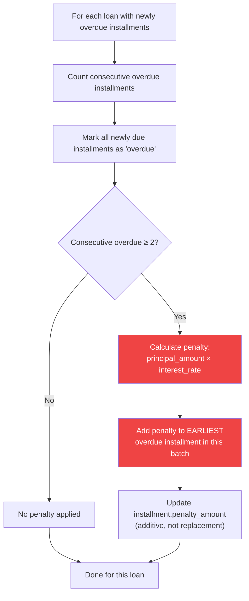
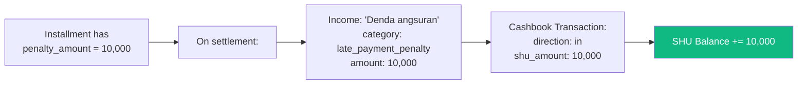

# ⚠️ Business Flow: Penalty System

> A developer guide on how penalties work in the loans system — when they're applied, the conditions, and the financial impact.

---

## Overview

The penalty system enforces financial accountability for overdue loan installments. Penalties are checked and applied automatically by a **cron job** and settled manually when the member pays.

---

## Key Rules at a Glance

| Rule                                    | Detail                                                                                      |
| --------------------------------------- | ------------------------------------------------------------------------------------------- |
| **When are penalties checked?**         | 21st of every month at midnight (cron job)                                                  |
| **When is an installment overdue?**     | When its `due_date` (20th) has passed and `status` is still `due`                           |
| **Condition for penalty**               | ≥ 2 **consecutive** overdue installments in the same loan                                   |
| **Penalty amount**                      | `principal_amount × interest_rate` (of the loan)                                            |
| **How many penalties per cycle?**       | **ONE** penalty per loan per monthly check, regardless of how many installments are overdue |
| **Which installment gets the penalty?** | The **earliest** (lowest installment number) among the newly overdue batch                  |
| **Where does penalty income go?**       | → SHU balance (category: `late_payment_penalty`)                                            |

---

## How It Works

### Step 1: Cron Job Triggers

```
Schedule: 0 0 21 * * (21st of every month, midnight)
Timezone: Asia/Jakarta (configurable via TZ env var)
```

The `LoansScheduler` runs `checkOverdueInstallments()` on the 21st because installments are due on the 20th. This gives members the full day of the 20th to pay.

### Step 2: Find Overdue Installments

The system queries for all installments where:

- `status = 'due'` (not yet marked as overdue)
- `due_date <= yesterday` (the 20th or earlier)

These installments are grouped by `loan_id` for per-loan processing.

### Step 3: Count Consecutive Overdue (Per Loan)

For each loan, the system:

1. Fetches **all** installments sorted by `installment_number`
2. Counts **consecutive** unpaid installments (status `due` or `overdue`)
3. Resets the counter when a `paid` installment is found

```
Example: Installments for Loan A
┌────────────┬────────┬──────────────────────┐
│ # Number   │ Status │ Consecutive Count    │
├────────────┼────────┼──────────────────────┤
│ 1          │ paid   │ 0 (reset)            │
│ 2          │ paid   │ 0 (reset)            │
│ 3          │ overdue│ 1                    │
│ 4          │ overdue│ 2                    │
│ 5          │ due    │ 3 ← being checked    │
│ 6          │ due    │ 4                    │
└────────────┴────────┴──────────────────────┘
Result: 4 consecutive overdue → PENALTY APPLIED
```

### Step 4: Apply Penalty (If Applicable)



> **Important**: The penalty is **one per loan per monthly cycle**, NOT one per overdue installment. Even if a loan has 5 overdue installments, only ONE penalty is applied.

---

## Penalty Calculation

```
penalty_amount = loan.principal_amount × loan.interest_rate
```

| Loan Example | Principal    | Interest Rate | Penalty per Cycle |
| ------------ | ------------ | ------------- | ----------------- |
| Loan A       | Rp 1,000,000 | 1% (0.01)     | Rp 10,000         |
| Loan B       | Rp 5,000,000 | 1.5% (0.015)  | Rp 75,000         |
| Loan C       | Rp 2,000,000 | 1% (0.01)     | Rp 20,000         |

---

## When Penalties Are Settled

Penalties are **not settled separately** — they are settled as part of the installment settlement.

When an admin settles an installment (`POST /api/loans/installments/:id/settle`), the system:

1. Reads the installment's `penalty_amount`
2. If `penalty_amount > 0`:
   - Creates an **income record** with category `late_payment_penalty`
   - Creates a **cashbook transaction** directing the penalty to the **SHU** balance
   - The penalty becomes cooperative income (SHU)



---

## Penalty Accumulation

Penalties are **additive**. If a loan keeps having overdue installments month after month, the earliest overdue installment accumulates penalties:

```
Month 1: Installment #3 due → not paid → marked overdue
         → Only 1 consecutive overdue → NO penalty

Month 2: Installment #4 due → not paid → marked overdue
         → 2 consecutive overdue → PENALTY applied to #3
         → #3 penalty_amount = 10,000

Month 3: Installment #5 due → not paid → marked overdue
         → 3 consecutive overdue → PENALTY applied to #5
         → #5 penalty_amount = 10,000

(Each month, the penalty goes to the earliest installment in that month's batch)
```

---

## Scenarios

### Scenario 1: First-Time Late Payment

```
Month 3: Installment #3 is due on the 20th
         Member doesn't pay
         21st: Cron runs → marks #3 as overdue
         Consecutive overdue count: 1
         → NO penalty (need ≥ 2)
```

### Scenario 2: Second Consecutive Late Payment

```
Month 4: Installment #4 is due on the 20th
         Member still hasn't paid #3 or #4
         21st: Cron runs → marks #4 as overdue
         Consecutive overdue count: 2 (#3, #4)
         → PENALTY APPLIED: 10,000 to installment #4
```

### Scenario 3: Member Pays Off Then Gets Late Again

```
Installment #1: paid ✓
Installment #2: paid ✓
Installment #3: overdue (consecutive: 1, no penalty)
Installment #4: member pays #3 and #4 ✓ (consecutive resets to 0)
Installment #5: overdue (consecutive: 1, no penalty)
Installment #6: overdue (consecutive: 2, PENALTY on #5)
```

The counter **resets** when a paid installment is encountered.

---

## Code References

| Component                | File                             | Function                           |
| ------------------------ | -------------------------------- | ---------------------------------- |
| Cron registration        | `src/loans/loans.scheduler.ts`   | `onModuleInit()`                   |
| Overdue processing entry | `src/loans/loans.service.ts`     | `processOverdueInstallments()`     |
| Per-loan penalty logic   | `src/loans/loans.service.ts`     | `processLoanOverdueInstallments()` |
| Penalty income creation  | `src/incomes/incomes.service.ts` | `createInstallmentPenaltyIncome()` |
| Settlement with penalty  | `src/loans/loans.service.ts`     | `settleInstallment()`              |

---

## Edge Cases

1. **Multiple loans for same user**: Each loan is processed independently. User could get penalties on multiple loans in the same month.
2. **Loan fully overdue**: If all installments are overdue, one penalty per month is still applied to the earliest in each batch.
3. **Manual status changes**: If an admin manually changes installment statuses via DB, the trigger still enforces the rules correctly in the next cron cycle.
4. **Server downtime on 21st**: If the cron misses, penalties are not retroactively applied — they only apply during the scheduled run.
