# 📊 Lumbung Mesari — Data Flow Diagrams

## 1. Member Registration & Activation Flow

---

## 2. Loan Lifecycle Flow

---

## 3. Cashbook Transaction Flow (Income)

This diagram shows how any income event flows through the system.

---

## 4. Cashbook Transaction Flow (Expense)

---

## 5. Overdue & Penalty Processing Flow

```mermaid
flowchart TD
    A["CRON: 21st of every month, midnight"] --> B["LoansScheduler.checkOverdueInstallments()"]
    B --> C["LoansService.processOverdueInstallments()"]
    C --> D["Find all 'due' installments past due_date"]
    D --> E["Group by loan_id"]

    E --> F["For each loan:"]
    F --> G["Count consecutive overdue installments"]
    G --> H["Mark all newly due installments as 'overdue'"]

    H --> I{"≥ 2 consecutive\noverdue?"}
    I -->|Yes| J["Apply ONE penalty\n(1% × principal_amount)\nto earliest overdue installment"]
    I -->|No| K["No penalty applied"]

    J --> L["installments.penalty_amount updated"]
    K --> L

    style A fill:#6366f1,stroke:#4f46e5,color:#fff
    style J fill:#ef4444,stroke:#dc2626,color:#fff
```

---

## 6. Mandatory Savings Flow

---

## 7. Balance Architecture Overview

