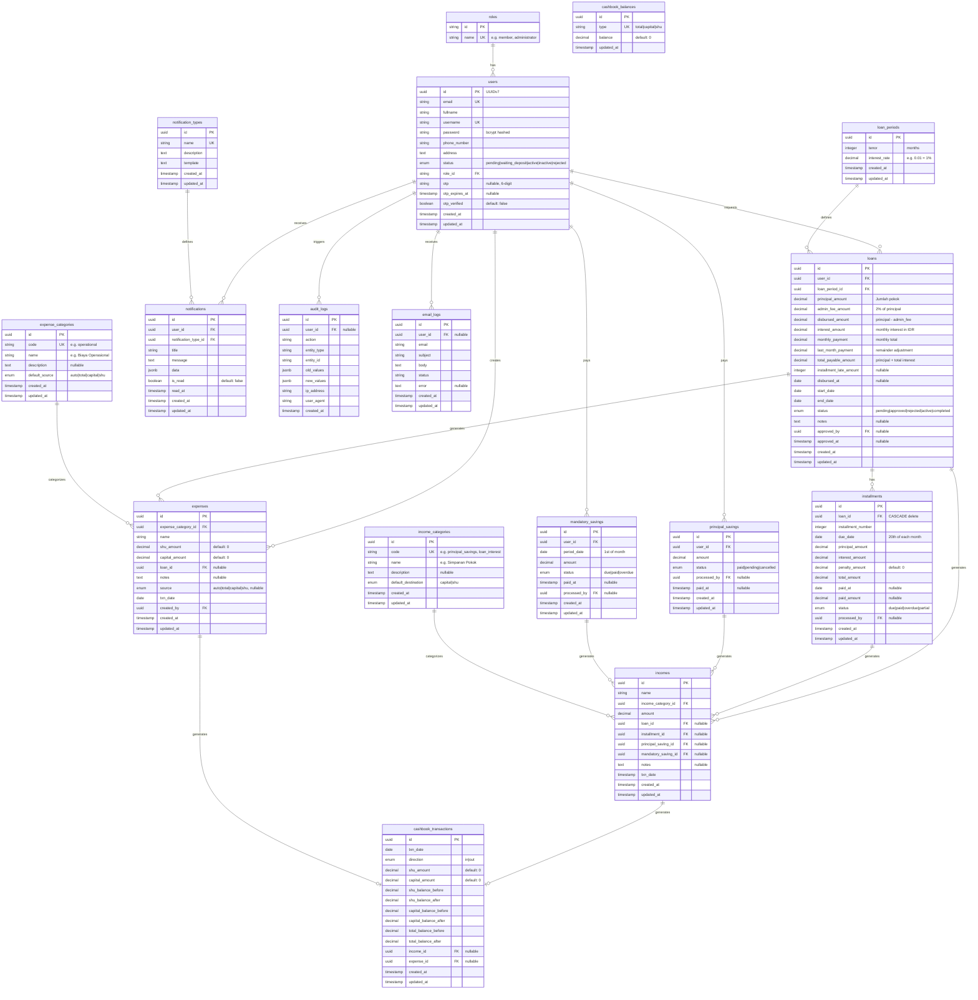

# 🗂️ Lumbung Mesari — Entity Relationship Diagram

> **Note:** This ERD reflects the **actual database schema** as implemented in the migration files. The previous `cooperative-erd.md` was a design document; this represents the live schema.

## Entity Relationship Diagram

---

## Table Summary

| Table                   | Rows Type   | Description                                           |
| ----------------------- | ----------- | ----------------------------------------------------- |
| `roles`                 | Reference   | User role definitions                                 |
| `users`                 | Master      | Member/admin accounts                                 |
| `loan_periods`          | Reference   | Predefined loan tenor + interest rate options         |
| `loans`                 | Transaction | Loan applications and their lifecycle                 |
| `installments`          | Transaction | Monthly payment schedule per loan                     |
| `principal_savings`     | Transaction | One-time membership fee payments                      |
| `mandatory_savings`     | Transaction | Monthly mandatory savings per member                  |
| `income_categories`     | Reference   | Categories for income records                         |
| `incomes`               | Transaction | All income entries (savings, installments, penalties) |
| `expense_categories`    | Reference   | Categories for expense records                        |
| `expenses`              | Transaction | All expense entries with source allocation            |
| `cashbook_transactions` | Ledger      | Immutable financial ledger with balance snapshots     |
| `cashbook_balances`     | Aggregate   | Current balance totals (SHU, Capital, Total)          |
| `audit_logs`            | Audit       | Administrative action trail                           |
| `notification_types`    | Reference   | Notification templates                                |
| `notifications`         | Transaction | User notification records                             |
| `email_logs`            | Audit       | Email delivery tracking                               |

---

## Key Indexes

| Index                          | Table               | Columns                         | Purpose                  |
| ------------------------------ | ------------------- | ------------------------------- | ------------------------ |
| `installments_loan_due_idx`    | `installments`      | `loan_id, due_date, status`     | Fast overdue lookup      |
| `mandatory_savings_period_idx` | `mandatory_savings` | `period_date, status`           | Period-based queries     |
| `notifications_user_id_idx`    | `notifications`     | `user_id`                       | User notifications       |
| `notifications_unread_idx`     | `notifications`     | `user_id WHERE is_read = false` | Partial index for unread |
| `idx_cashbook_balances_type`   | `cashbook_balances` | `type`                          | Fast balance lookup      |

---

## Key Constraints

| Constraint                                  | Type                           | Description                                                |
| ------------------------------------------- | ------------------------------ | ---------------------------------------------------------- |
| `check_max_loans_per_user`                  | Trigger (BEFORE INSERT/UPDATE) | Max 3 loans per user in pending/approved/active status     |
| `chk_expense_amounts_positive`              | CHECK                          | `shu_amount + capital_amount > 0` on expenses              |
| `chk_cashbook_amounts_positive`             | CHECK                          | `shu_amount + capital_amount > 0` on cashbook_transactions |
| `installments(loan_id, installment_number)` | UNIQUE                         | No duplicate installment numbers per loan                  |
| `mandatory_savings(user_id, period_date)`   | UNIQUE                         | One savings record per user per month                      |
