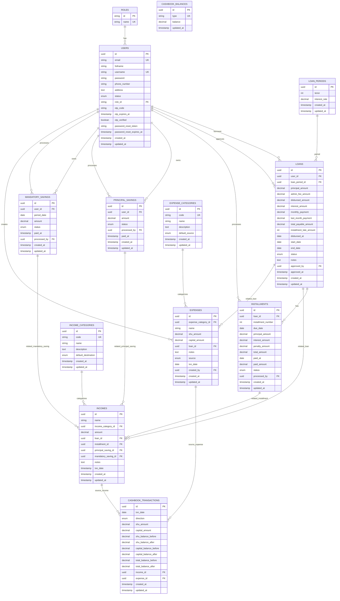

# Lumbung Mesari ERD

This ERD reflects the active schema from migrations and excludes dead tables in the notification/audit area.

```mermaid
erDiagram
    ROLES {
        string id PK
        string name UK
    }

    USERS {
        uuid id PK
        string email UK
        string fullname
        string username UK
        string password
        string phone_number
        text address
        enum status
        string role_id FK
        string otp_code
        timestamp otp_expires_at
        boolean otp_verified
        string password_reset_token
        timestamp password_reset_expires_at
        timestamp created_at
        timestamp updated_at
    }

    LOAN_PERIODS {
        uuid id PK
        int tenor
        decimal interest_rate
        timestamp created_at
        timestamp updated_at
    }

    LOANS {
        uuid id PK
        uuid user_id FK
        uuid loan_period_id FK
        decimal principal_amount
        decimal admin_fee_amount
        decimal disbursed_amount
        decimal interest_amount
        decimal monthly_payment
        decimal last_month_payment
        decimal total_payable_amount
        int installment_late_amount
        date disbursed_at
        date start_date
        date end_date
        enum status
        text notes
        uuid approved_by FK
        timestamp approved_at
        timestamp created_at
        timestamp updated_at
    }

    INSTALLMENTS {
        uuid id PK
        uuid loan_id FK
        int installment_number
        date due_date
        decimal principal_amount
        decimal interest_amount
        decimal penalty_amount
        decimal total_amount
        date paid_at
        decimal paid_amount
        enum status
        uuid processed_by FK
        timestamp created_at
        timestamp updated_at
    }

    PRINCIPAL_SAVINGS {
        uuid id PK
        uuid user_id FK
        decimal amount
        enum status
        uuid processed_by FK
        timestamp paid_at
        timestamp created_at
        timestamp updated_at
    }

    MANDATORY_SAVINGS {
        uuid id PK
        uuid user_id FK
        date period_date
        decimal amount
        enum status
        timestamp paid_at
        uuid processed_by FK
        timestamp created_at
        timestamp updated_at
    }

    INCOME_CATEGORIES {
        uuid id PK
        string code UK
        string name
        text description
        enum default_destination
        timestamp created_at
        timestamp updated_at
    }

    INCOMES {
        uuid id PK
        string name
        uuid income_category_id FK
        decimal amount
        uuid loan_id FK
        uuid installment_id FK
        uuid principal_saving_id FK
        uuid mandatory_saving_id FK
        text notes
        timestamp txn_date
        timestamp created_at
        timestamp updated_at
    }

    EXPENSE_CATEGORIES {
        uuid id PK
        string code UK
        string name
        text description
        enum default_source
        timestamp created_at
        timestamp updated_at
    }

    EXPENSES {
        uuid id PK
        uuid expense_category_id FK
        string name
        decimal shu_amount
        decimal capital_amount
        uuid loan_id FK
        text notes
        enum source
        date txn_date
        uuid created_by FK
        timestamp created_at
        timestamp updated_at
    }

    CASHBOOK_TRANSACTIONS {
        uuid id PK
        date txn_date
        enum direction
        decimal shu_amount
        decimal capital_amount
        decimal shu_balance_before
        decimal shu_balance_after
        decimal capital_balance_before
        decimal capital_balance_after
        decimal total_balance_before
        decimal total_balance_after
        uuid income_id FK
        uuid expense_id FK
        timestamp created_at
        timestamp updated_at
    }

    CASHBOOK_BALANCES {
        uuid id PK
        string type UK
        decimal balance
        timestamp updated_at
    }

    ROLES ||--o{ USERS : has
    USERS ||--o{ LOANS : borrower
    LOAN_PERIODS ||--o{ LOANS : period
    USERS ||--o{ LOANS : approves
    LOANS ||--o{ INSTALLMENTS : has
    USERS ||--o{ INSTALLMENTS : processes

    USERS ||--o{ PRINCIPAL_SAVINGS : owns
    USERS ||--o{ PRINCIPAL_SAVINGS : processes
    USERS ||--o{ MANDATORY_SAVINGS : owns
    USERS ||--o{ MANDATORY_SAVINGS : processes

    INCOME_CATEGORIES ||--o{ INCOMES : categorizes
    LOANS ||--o{ INCOMES : related_loan
    INSTALLMENTS ||--o{ INCOMES : related_installment
    PRINCIPAL_SAVINGS ||--o{ INCOMES : related_principal_saving
    MANDATORY_SAVINGS ||--o{ INCOMES : related_mandatory_saving

    EXPENSE_CATEGORIES ||--o{ EXPENSES : categorizes
    USERS ||--o{ EXPENSES : creates
    LOANS ||--o{ EXPENSES : related_loan

    INCOMES ||--o{ CASHBOOK_TRANSACTIONS : source_income
    EXPENSES ||--o{ CASHBOOK_TRANSACTIONS : source_expense
```
